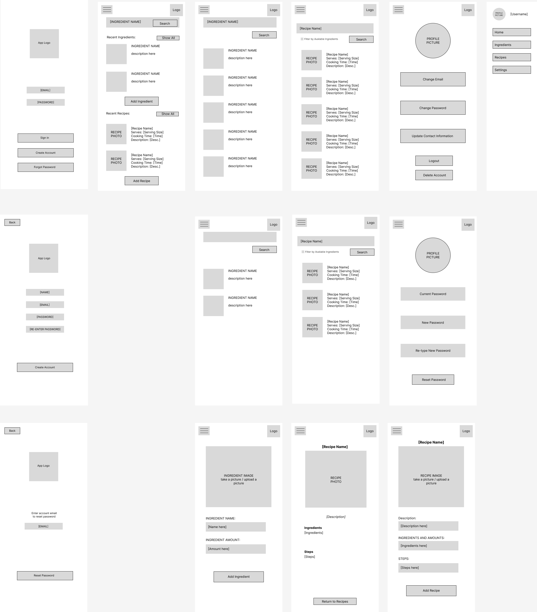
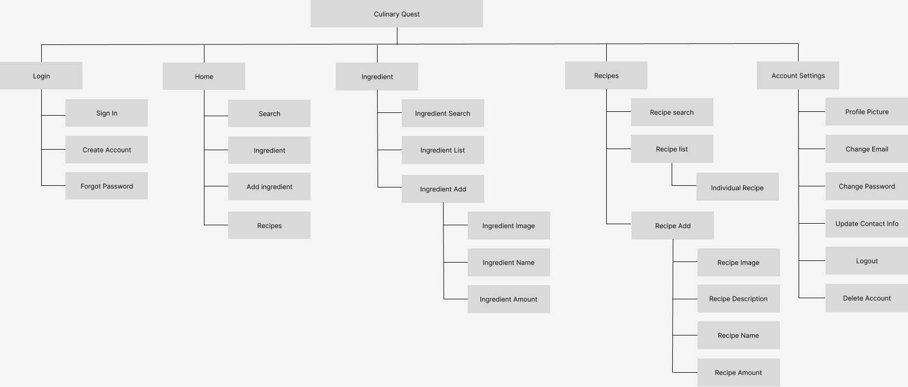

# User Experience Design

This repository contains instructions and files for two assignments that together comprise the user experience design phase of a web app.

Replace the contents of this file with the completed assignments, as described in:

- [app map & wireframe instructions](instructions-0a-app-map-wireframes.md).
- [prototype instructions](instructions-0b-prototyping.md)

Wireframe and Prototype: https://www.figma.com/file/5tDOUNV9ECZHvuCGB9fXJr/Wireframe%2FPrototype?type=design&node-id=0%3A1&mode=design&t=D8IrEMzIG8hzVy5C-1

App-Map: https://www.figma.com/file/4ZtkH111DJZG6AunC6QScm/App-Map?type=design&node-id=0%3A1&mode=design&t=tWhzDJ01POX5nMSW-1

